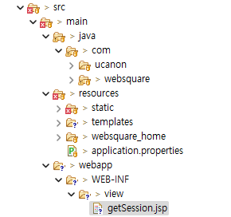
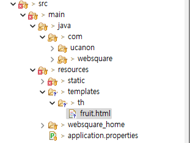

# Thymeleaf와 JSP 동시에 사용하기

SpringBoot 프로젝트에서 Thymeleaf와 JSP에 사용하는 방법을 설명합니다.


## 2. JSP 설정하기

### 1) pom.xml에 JSP 라이브러리 추가

```xml
<dependency>
    <groupId>org.springframework.boot</groupId>
    <artifactId>spring-boot-starter-thymeleaf</artifactId>
</dependency>
```


## 2. Thymeleaf 설정하기

### 1) pom.xml에 Thymeleaf 라이브러리 추가

```xml
<dependency>
    <groupId>javax.servlet</groupId>
    <artifactId>jstl</artifactId>
</dependency>
<dependency>
    <groupId>org.apache.tomcat.embed</groupId>
    <artifactId>tomcat-embed-jasper</artifactId>
    <scope>provided</scope>
</dependency>
```

### 2) application.properties에 JSP 설정 추가

```properties
# JSP 설정
spring.mvc.view.prefix=/WEB-INF/view/
spring.mvc.view.suffix=.jsp
```



위와 같이 webapp/WEB-INF/view/ 디렉터리에 JSP 파일(getSession.jsp) 파일을 생성합니다.

아래는 샘플 파일 코드(getSession.jsp) 입니다.

```jsp
<%@ page contentType="text/html; charset=utf-8" session="true"%>                    
<%@ page import="java.util.Date"%>
<html>
<head>
</head>
<body>
세션 ID : <%= session.getId() %> <br>
세션 생성 시간 : <%= new Date(session.getCreationTime()) %> <br>
세션 최근 접근 시간 : <%= new Date(session.getLastAccessedTime())  %> <br>
</body>
</html>
```

아래는 getSession.jsp 파일을 반환하는 Controller(SessionController.java) 샘플 파일 코드입니다.

```java
import java.util.Locale;
import org.springframework.stereotype.Controller;
import org.springframework.ui.Model;
import org.springframework.web.bind.annotation.GetMapping;

@Controller
public class SessionController {
	
	@GetMapping(value = "/getSession")
	public String getSession(Locale locale, Model model) {
		return "getSession";
	}
}
```


### 2) application.properties에 Thymeleaf 설정 추가

```properties
# Thymeleaf 설정
spring.thymeleaf.cache=false
spring.thymeleaf.prefix=classpath:templates/
spring.thymeleaf.suffix=.html
spring.thymeleaf.view-names=th/*
```

JSP를 사용하기 위해서 Thymeleaf 설정에서 중요한 부분이 view-names 설정입니다.

view-names를 "th/*"로 설정할 경우 thymeleaf template 파일의 디렉터리와 Controller의 Path를 모두 "th"로 설정해야 합니다.



아래는 샘플 파일(fruit.html)입니다.

```html
<!DOCTYPE html>
<html>
<head>
<meta charset="UTF-8">
<title>thymeleaf sample</title>
</head>
<body>
    <span th:text="${fruit.fruit1}"></span><br/>
    <span th:text="${fruit.fruit2}"></span><br/>
    <span th:text="${fruit.fruit3}"></span><br/>
</body>
</
```


그리고 fruit.html 파일을 호출하는 Controller의 Path로 아래와 같이 "th"로 해야 합니다.

```java
import java.util.HashMap;
import java.util.Map;

import org.springframework.stereotype.Controller;
import org.springframework.ui.Model;
import org.springframework.web.bind.annotation.GetMapping;
import org.springframework.web.bind.annotation.RequestMapping;

@Controller
// URL을 "th"로 해야 합니다.
@RequestMapping("/th")
public class FruitController {
 
	@RequestMapping(value = "/fruit")
    public String getFruit(Model model) {
    	Map<String, String> fruitmap = new HashMap<String, String>();
    	fruitmap.put("fruit1", "apple");
    	fruitmap.put("fruit2", "banana");
    	fruitmap.put("fruit3", "orange");
        model.addAttribute("fruit", fruitmap);
        return "th/fruit.html";   // "th" 디렉터리의 fruit.html 템플릿 파일을 호출합니다.
    }
}
```

