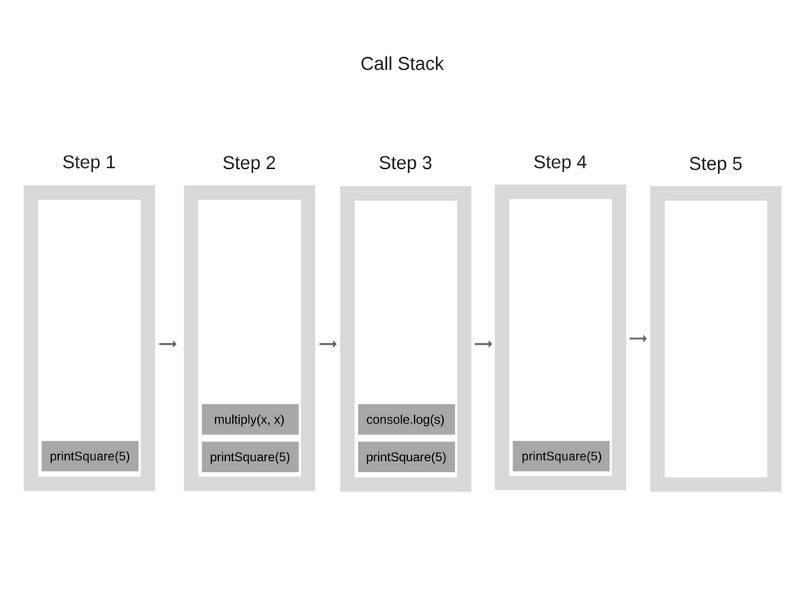
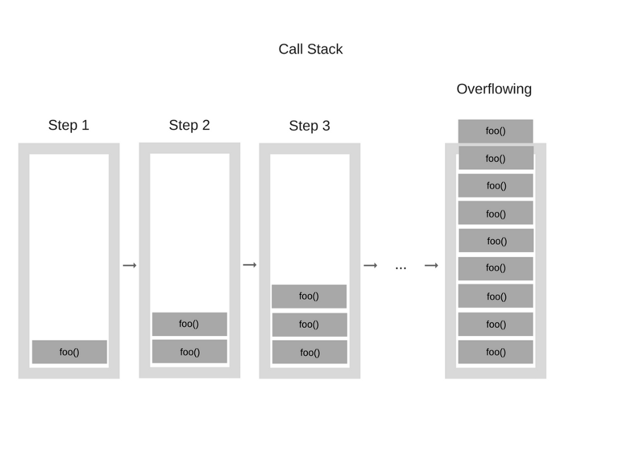

# 자바스크립트는 어떻게 동작하는가?

* 백선기님께서 번역하신 "How Javascript Works" 문서를 기역해야할 내용들을 정리한 문서입니다.


## Overview

* Chrome의 Javascript 엔진은 V8 엔진입니다.
* Javascript 엔진은 Single Thread이고, Callback Queue를 사용합니다.


## Javascript Engine

* V8 엔진의 메모리 영역은 크게 두 부분으로 구성됩니다.
* Memory Heap
  * 메모리 할당이 이루어지는 곳 입니다.
* Call Stack
  * 코드가 실행되면서 스택 프레임이 쌓이는 곳입니다.


## Runtime

* Javascript Engine은 Single Thread로 동작합니다.
* Javascript는 Javascript Engine 이외에 Web API라는 것이 있습니다.
* DOM, AJAX, setTimeout 등이 Web API에 포함됩니다.

* 이벤트 처리를 위한 Event Loop와 Callback Queue도 있습니다.


위의 화면은  Javascript 엔진의 아키텍처 구조입니다.


## Call Stack

* Javascript는 기본적으로 Single Thread 방식으로 동작합니다.
* 이것은 Call Stack이 1개이고, 한 번에 1개의 코드만을 실행할 수 있다는 의미입니다.
* Call Stack은 현재 실행중인 코드의 위치가 어디인지를 기록하는 자료 구조입니다.
* 우리가 어떤 함수 안으로 들어가는 순간 해당 함수를 Call Stack에 저장하고, 그 함수의 실행을 마치고, 자신을 호출한 함수로 돌아오는 순간, 그 함수는 Call Stack에서 제거됩니다.
* 아래의 Javascript Code를 실행될 때, Call Stack에 함수가 어떤 식으로 쌓이는지 보도록 하겠습니다.

```javascript
function multiply(x, y) {
    return x * y;
}
function printSquare(x) {
    var s = multiply(x, x);
    console.log(s);
}
printSquare(5);
```



* 콜 스택의 각각을 Stack Frame이라고 부릅니다.
* 이것은 Exception가 발생했을 때 Stack Trace가 만들어지는 방식입니다.
* Stack Trace란 Exception가 발생했을 때 Call Stack의 상태입니다.


## Call Stack Overflowing

* Call Stack에 함수를 쌓을 때, 무한루프 등이 발생하면서 Call Stack이 꽉 차게 되었을 때 Call Stack Overflowing이 발생하면서, Blowing The stack(스택 날림)이 발생합니다. 
* 주로 Recursive Function이 정상적으로 동작하지 않을 때 주로 발생합니다.

* 아래와 같이 무한루프에 빠지게 하는 코드를 실행해 봅시다.

```javascript
function foo() {
    foo();
}
foo();
```

* 아래는 위의 코드가 실행되면서 Call Stack Overflowing에 빠지는 것을 설명한 그림입니다.



* 위의 Call Stack Overflowing이 발생하면 아래와 같은 에러 메시지가 표시됩니다.

```javasript
> Uncaught RangError : Maximum call stack size exceeded
```


## Concurrency and Event Loop

* Call Stack 안에 수행 시간이 긴 함수가 있으면 어떤 일이 벌어질까요?
* 브라우저는 Call Stack 내에 많은 작업을 수행하면서 꽤 긴 시간 동안 작업을 수행 경우, 그 시간 동안 사용자에게 아무런 응답을 줄 수 없습니다.

  


## 참고자료

> [https://engineering.huiseoul.com/자바스크립트는-어떻게-작동하는가-엔진-런타임-콜스택-개관-ea47917c8442](https://engineering.huiseoul.com/자바스크립트는-어떻게-작동하는가-엔진-런타임-콜스택-개관-ea47917c8442)
> [https://engineering.huiseoul.com/자바스크립트는-어떻게-작동하는가-v8-엔진의-내부-최적화된-코드를-작성을-위한-다섯-가지-팁-6c6f9832c1d9](https://engineering.huiseoul.com/자바스크립트는-어떻게-작동하는가-v8-엔진의-내부-최적화된-코드를-작성을-위한-다섯-가지-팁-6c6f9832c1d9)
> [https://blog.sessionstack.com/how-does-javascript-actually-work-part-1-b0bacc073cf](https://blog.sessionstack.com/how-does-javascript-actually-work-part-1-b0bacc073cf)
> [https://blog.sessionstack.com/how-javascript-works-inside-the-v8-engine-5-tips-on-how-to-write-optimized-code-ac089e62b12e](https://blog.sessionstack.com/how-javascript-works-inside-the-v8-engine-5-tips-on-how-to-write-optimized-code-ac089e62b12e)

