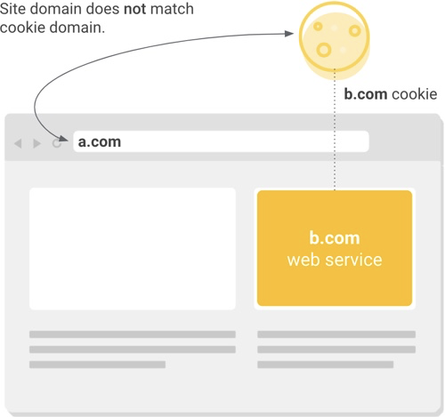

# IFrame 내 세션 및 쿠키 미유지 문제와 해결 방안

최근 웹 브라우저의 보안 정책 강화로 인해, iframe 내에서 세션과 쿠키가 유지되지 않는 문제가 발생하고 있습니다. 이러한 현상은 주로 쿠키의 `SameSite` 속성 정책 변경과 관련이 있습니다. 


## 1. 문제 원인

기존에는 웹 브라우저에서 서버에서 쿠키를 생성할 때, 쿠키의 `SameSite` 속성이 명시되지 않은 경우, 웹 브라우저에서 기본 값이 `None`이었으나, 최근 Chrome과 Edge 등의 최신 웹 브라우저에서는 이를 `Lax`로 변경하였습니다. 이로 인해, 다른 도메인에서 iframe을 통해 콘텐츠를 불러올 때 쿠키가 전송되지 않아 세션이 유지되지 않는 문제가 발생합니다. 

Chrome 브라우저는 2020년 2월 4일에 출시된 80버전부터 쿠키의 `SameSite` 속성 기본값을 `None`에서 `Lax`로 변경하였습니다. 이로 인해, `SameSite` 속성을 명시하지 않은 쿠키는 기본적으로 `Lax`로 처리되어, 일부 크로스 사이트 요청에서 쿠키 전송이 제한될 수 있습니다. 

**크로스 사이트 요청**이란, 사용자가 현재 방문 중인 웹사이트와 다른 도메인으로의 요청을 의미합니다. 예를 들어, 아래와 같이 `a.com`에서 `b.com`으로의 요청은 크로스 사이트 요청으로 볼 수 있습니다.




**최신 Chrome과 Edge 브라우저의 기본 설정**이 보안 강화를 위해 `SameSite` 속성을 `Lax`로 설정합니다. 이로 인해, 크로스 사이트 요청 시 쿠키가 전송되지 않아 **세션이 유지되지 않거나 JWT 토큰이 전달되지 않는 문제**가 발생하면서 로그인 세션이 유지 되지 않는 현상이 발생합니다.


## 2. 웹 브라우저의 SameSite 속성 정책

**`SameSite` 속성**은 쿠키가 **크로스 사이트 요청**에 포함되는 방식을 제어하여 **CSRF(Cross-Site Request Forgery)** 공격을 방지하는 데 도움을 줍니다. 이 **`SameSite` 속성**은 다음과 같습니다. 

- **`Strict`**: 쿠키는 동일한 사이트에서 발생하는 요청에만 전송됩니다.
- **`Lax`**: 기본적으로 동일한 사이트에서 발생하는 요청에만 쿠키가 전송되지만, 일부 안전한 메서드(GET)나 탭에서의 링크 클릭 등은 예외로 인정되어 쿠키가 전송될 수 있습니다.
- **`None`**: 쿠키는 크로스 사이트 요청을 포함한 모든 상황에서 전송됩니다. 이 경우, **`Secure`** 속성을 함께 설정하여 쿠키가 HTTPS 연결에서만 전송되도록 해야 합니다.


## 3. 해결 방안

서로 다른 도메인을 참조하는 크로스 사이트에서 쿠키를 사용해야 하는 경우에는 쿠키 유지 되지 않는 현상에 대한 해결 방안으로는 다음과 같은 방법을 고려할 수 있습니다.

1. **`SameSite` 속성을 `None`으로 설정하고, `Secure` 속성을 추가**
   - 쿠키를 생성할 때 `SameSite=None; Secure`로 설정하여 크로스 사이트 요청에서도 쿠키가 전송되도록 합니다.
   - 이때, 애플리케이션이 HTTPS를 통해 제공되고 있는지 확인해야 합니다.
2. **프론트엔드와 백엔드를 동일한 사이트로 구성**
   - 프록시 서버를 사용하여 프론트엔드와 백엔드 간의 통신을 동일한 도메인 내에서 처리함으로써, **SameSite** 쿠키 제한으로 인한 세션 및 쿠키 미유지 문제를 해결할 수 있습니다. 이를 위해 웹 서버의 **리버스 프록시(Reverse Proxy)**를 설정합니다.
   - 프론트엔드와 백엔드를 동일한 최상위 도메인 하의 서브도메인으로 설정하여, 브라우저가 동일한 사이트로 인식하도록 합니다.
   - 예를 들어, 프론트엔드를 `frontend.example.com`, 백엔드를 `api.example.com`으로 설정합니다.
3. **쿠키 대신 다른 저장소 사용**
   - JWT 토큰을 쿠키 대신 **로컬 스토리지**나 **세션 스토리지**에 저장하여, `SameSite` 속성의 영향을 받지 않도록 합니다.
   - 이 경우, **XSS(Cross-Site Scripting)** 공격에 대한 추가적인 보안 조치가 필요합니다.

각 방법은 보안과 편의성 측면에서 장단점이 있으므로, 애플리케이션의 특성과 요구 사항에 따라 적절한 방안을 선택해야 합니다. 특히, `SameSite=None` 설정은 CSRF 공격에 취약할 수 있으므로, 추가적인 보안 조치를 고려해야 합니다. 또한, 브라우저마다 `SameSite` 속성에 대한 지원과 기본 값이 다를 수 있으므로, 다양한 브라우저 환경에서의 테스트도 중요합니다.


## 4. 코드 작성을 통한 `SameSite=None`, `Secure` 속성 추가 예시

서버에서 쿠키를 설정할 때 `SameSite=None`과 `Secure` 속성을 명시적으로 지정해야 합니다. 이를 통해 크로스 사이트 요청에서도 쿠키가 전송될 수 있습니다. 단, `Secure` 속성을 설정하려면 사이트가 HTTPS를 통해 제공되어야 합니다.


### 4.1. JAVA 예시 코드

Java 서블릿 환경에서는 `HttpServletResponse`를 사용하여 쿠키를 설정할 수 있습니다. 쿠키를 생성할 때 `SameSite=None`과 `Secure` 속성을 명시적으로 지정해야 합니다. 이를 통해 크로스 사이트 요청에서도 쿠키가 전송될 수 있습니다. 단, `Secure` 속성을 설정하려면 사이트가 HTTPS를 통해 제공되어야 합니다.

```java
response.setHeader("Set-Cookie", "key=value; SameSite=None; Secure");
```


### 4.2. Spring MVC Project 예시 코드

Spring MVC 환경에서는 인터셉터나 필터를 사용하여 응답 헤더에 `SameSite` 속성을 추가할 수 있습니다. 이를 통해 모든 응답에 대해 일관되게 `SameSite` 속성을 설정할 수 있습니다.

아래와 같이 SameSiteCookieFilter 클래스를 생성합니다.

```java
package com.inswave.wrm.interceptor;

import javax.servlet.*;
import javax.servlet.http.Cookie;
import javax.servlet.http.HttpServletResponse;
import java.io.IOException;
import java.util.Collection;

public class SameSiteCookieFilter implements Filter {

    @Override
    public void doFilter(ServletRequest request, ServletResponse response, FilterChain chain)
            throws IOException, ServletException {
        chain.doFilter(request, response);
        addSameSiteAttribute((HttpServletResponse) response);
    }

    private void addSameSiteAttribute(HttpServletResponse response) {
        String header = response.getHeader("Set-Cookie");
        if (header != null && header.contains("JSESSIONID")) {
            String updatedHeader = header + "; SameSite=None; Secure";
            response.setHeader("Set-Cookie", updatedHeader);
        }       
    }

	@Override
	public void init(FilterConfig filterConfig) throws ServletException {
		// TODO Auto-generated method stub
	}

	@Override
	public void destroy() {
		// TODO Auto-generated method stub
	}
}

```


web.xml 파일에 sameSiteCookieFilter를 추가합니다.

```xml
	<filter>
		<filter-name>sameSiteCookieFilter</filter-name>
		<filter-class>com.inswave.wrm.interceptor.SameSiteCookieFilter</filter-class>
	</filter>
	<filter-mapping>
		<filter-name>sameSiteCookieFilter</filter-name>
		<url-pattern>/*</url-pattern>
	</filter-mapping>
```


### 4.3. Spring Boot Project 예시 코드

Spring Boot 2.6.0 이상 버전에서는 application.properties 설정 파일을 통해 `SameSite` 속성을 간편하게 설정할 수 있습니다.

```properties 
server.servlet.session.cookie.same-site=none
```


## 5. 웹 서버 및 WAS 설정을 통한 `SameSite=None`, `Secure` 속성 추가 예시

웹 서버나 Apache Tomcat에서 쿠키의 `SameSite=None` 및 `Secure` 속성을 설정하는 방법은 다음과 같습니다.


### 5.1. Tomcat에서 설정하기

**Tomcat 버전 9.0.30 이상**에서는 다음과 같이 설정할 수 있습니다:

1. **`server.xml` 파일 수정**:

   `{TOMCAT_HOME}/conf/server.xml` 파일을 열어 `<Context>` 태그 내에 다음 설정을 추가합니다:

   ```xml
   <Context docBase="xxx" path="/" reloadable="true" source="org.eclipse.jst.jee.server:xxx">
   	<CookieProcessor sameSiteCookies="none" secure="true"/>
   </Context>
   ```

   이 설정은 쿠키의 `SameSite` 속성을 `None`으로 지정합니다. 

   <u>**주의**: `Secure` 속성을 설정하려면 웹 서버가 HTTPS를 통해 서비스를 제공해야 합니다.</u>

   

2. **`web.xml` 파일 수정**:

   `{TOMCAT_HOME}/conf/web.xml` 파일을 열어 `<session-config>` 태그 내에 다음 설정을 추가합니다:

   ```xml
   <session-config>
       <cookie-config>
           <http-only>true</http-only>
           <secure>true</secure>
       </cookie-config>
   </session-config>
   ```

   이 설정은 쿠키에 `HttpOnly`와 `Secure` 속성을 추가하여 보안을 강화합니다. 

   

### 5.2. Apache HTTP Server에서 설정하기

Apache HTTP Server를 사용하는 경우, 다음과 같이 설정할 수 있습니다:

1. **`httpd.conf` 파일 수정**:

   `httpd.conf` 또는 관련 설정 파일에서 다음 지시문을 추가합니다:

   ```
   Header always edit Set-Cookie (.*) "$1; Secure SameSite=None;"
   ```
   
   이 설정은 모든 `Set-Cookie` 헤더에 `Secure` 및 `SameSite=None` 속성을 추가합니다. 
   
   

### 5.3. Nginx에서 설정하기

Nginx를 사용하는 경우, 다음과 같이 설정할 수 있습니다:

1. **`nginx.conf` 파일 수정**:

   `nginx.conf` 또는 관련 설정 파일에서 서버 블록 내에 다음 지시문을 추가합니다:

   ```
   location / {
       proxy_cookie_path / "/; secure; SameSite=None";
   }
   ```

   이 설정은 모든 쿠키 경로에 `Secure` 및 `SameSite=None` 속성을 추가합니다. 


### 5.4. 주의사항
- `SameSite=None` 설정 시 반드시 `Secure` 속성을 함께 지정해야 하며, 이는 HTTPS 프로토콜을 사용해야 함을 의미합니다.
- 웹 서버의 설정 변경 후에는 반드시 해당 서버를 재시작하여 변경 사항을 적용해야 합니다.


## 6. 참고 사이트

- https://chgbook.tistory.com/35
- https://web.dev/articles/samesite-cookie-recipes?hl=ko
- https://web.dev/articles/samesite-cookies-explained?hl=ko
- https://marklee1117.tistory.com/53
- https://chromestatus.com/feature/5088147346030592
- https://jake-seo-dev.tistory.com/392
- https://developer.mozilla.org/en-US/docs/Web/Privacy/Third-party_cookies
- https://www.certkorea.co.kr/bbs/board.php?bo_table=31&wr_id=42&utm_source=chatgpt.com

